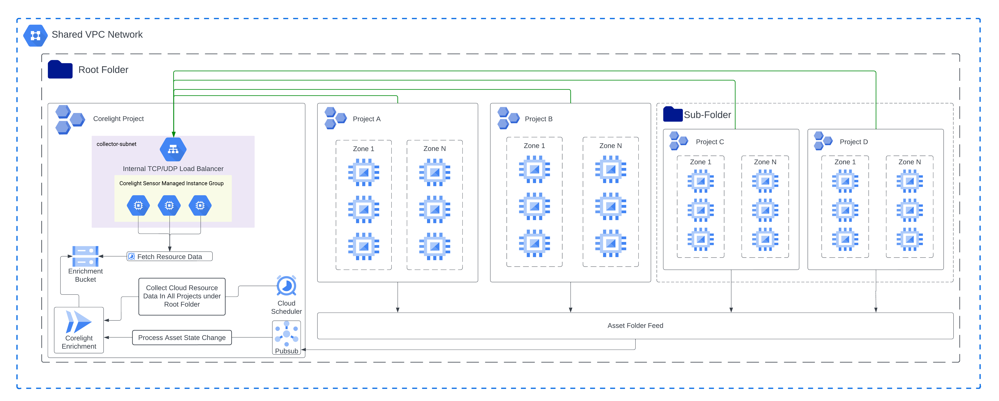

# terraform-gcp-enrichment



## Usage

```terraform
module "enrichment_org_iam" {
  source = "github.com/corelight/terraform-gcp-enrichment/modules/org_iam"

  organization_id = "987654321"
  custom_org_role_id = "corelight_enrichment_role"
}

module "enrichment" {
  source = "github.com/corelight/terraform-gcp-enrichment"

  location               = "us-central1"
  zone                   = "us-central1-a"
  project_id             = "project-12345"
  enrichment_bucket_name = "enrichment-data-54321"
  folder_id              = "123456789" # The root folder to enumerate
  service_account_id     = "enrichment-service-account"
  organization_role_id   = module.enrichment_org_iam.custom_org_role_id

  labels = {
    terraform : true,
    example : true,
    purpose : "Corelight"
  }
}
```

## Deployment

The variables for this module all have default values that can be overwritten
to meet your naming and compliance standards.

Deployment examples can be found [here][].

[here]: https://github.com/corelight/corelight-cloud/tree/main/terraform/gcp-cloud-enrichment

## License

The project is licensed under the [MIT][] license.

[MIT]: LICENSE
